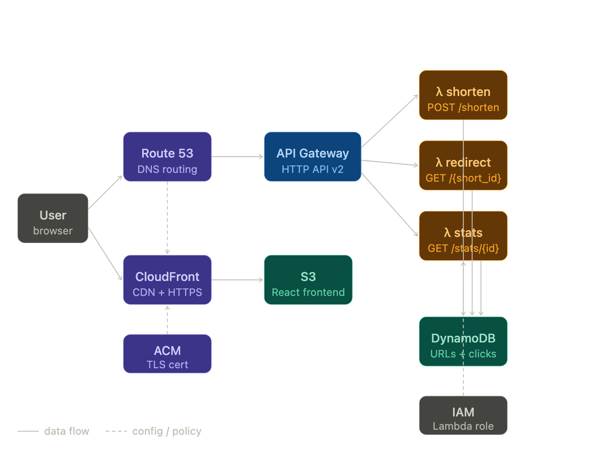

# URL Shortener

A serverless URL shortener built on AWS. Paste a long URL, get a short one, track clicks.

**Live:** [short.pranav-main-bucket-1.click](https://short.pranav-main-bucket-1.click)

---

## Architecture



Three Lambda functions behind API Gateway (HTTP API v2):

| Route | Lambda | What it does |
|---|---|---|
| `POST /shorten` | `shorten.py` | Validates URL, checks for duplicates via GSI, generates collision-safe 6-char ID, writes to DynamoDB with 30-day TTL |
| `GET /r/{short_id}` | `redirect.py` | Looks up original URL, increments click counter, returns 302 |
| `GET /stats/{short_id}` | `stats.py` | Returns original URL and click count |

The React frontend is deployed to a private S3 bucket served through CloudFront with a custom domain. CloudFront uses two origin behaviors: static assets go to S3, `/r/*` and `/stats/*` paths route to API Gateway.

---

## Tech stack

| Layer | Technology |
|---|---|
| Frontend | React + TypeScript (Vite) |
| Hosting | S3 + CloudFront + Route 53 |
| API | AWS API Gateway (HTTP API v2) |
| Compute | AWS Lambda (Python 3.12) |
| Database | DynamoDB (on-demand, with GSI) |
| IaC | Terraform |
| TLS | AWS Certificate Manager (us-east-1) |
| Testing | pytest + moto (46 tests, zero real AWS calls) |
| Observability | CloudWatch Logs |

---

## Project structure

```
url-shortener/
├── terraform/
│   ├── main.tf          # DynamoDB, IAM, Lambda, API Gateway
│   ├── frontend.tf      # S3, CloudFront, ACM, Route 53, stats Lambda
│   ├── variables.tf
│   ├── outputs.tf
│   └── lambda/
│       ├── shorten.py
│       ├── redirect.py
│       └── stats.py
├── frontend/
│   ├── src/
│   │   ├── App.tsx
│   │   └── App.css
│   └── .env.production
└── tests/
    ├── test_shorten.py      # 20 tests
    ├── test_redirect.py     # 12 tests
    └── test_stats.py        # 14 tests
```

---

## Running tests

```bash
pip install -r requirements-dev.txt
python -m pytest tests/ -v
```

All tests mock DynamoDB with moto — no AWS credentials or live infrastructure needed. Coverage includes happy paths, validation errors, malformed input, duplicate URL detection, collision retry logic, TTL correctness, and CORS headers.

---

## Local development

**Prerequisites:** Node 18+, Python 3.12, Terraform 1.5+, AWS CLI configured

```bash
# Frontend
cd frontend && npm install && npm run dev

# Infrastructure
cd terraform && terraform init && terraform plan
```

---

## Deploy

```bash
# 1. Apply infrastructure
cd terraform && terraform apply

# 2. Build and upload frontend
cd ../frontend && npm run build
aws s3 sync dist/ s3://$(cd ../terraform && terraform output -raw frontend_bucket) --delete

# 3. Invalidate CloudFront cache
aws cloudfront create-invalidation \
  --distribution-id $(cd ../terraform && terraform output -raw cloudfront_id) \
  --paths "/*"
```

---

## Design decisions

**DynamoDB over RDS** — the access pattern is almost entirely single-item lookups by `short_id`. A hash key lookup is O(1) and on-demand billing means zero cost at zero traffic.

**Lambda over a server** — URL shorteners are bursty. Lambda scales to zero when idle and handles spikes without provisioning. Cold starts are acceptable for a redirect use case.

**302 over 301** — redirect returns 302 (temporary) not 301 (permanent). Browsers cache 301s indefinitely, which would prevent click counts from incrementing after the first visit.

**CloudFront path-based routing** — rather than a separate subdomain for the API, CloudFront uses ordered cache behaviors: `/r/*` and `/stats/*` route to API Gateway, everything else serves the S3 frontend. The S3 bucket is fully private — only CloudFront can read it via an Origin Access Control policy.

**Duplicate URL detection via GSI** — `shorten.py` queries a Global Secondary Index on `original_url` before generating a new ID. If the URL was already shortened, the existing short ID is returned instead of creating a duplicate entry.

**Collision handling** — `shorten.py` generates a random 6-character alphanumeric ID (~56 billion possibilities), checks DynamoDB for a collision, and retries up to 3 times. At current scale this is effectively never triggered, but the logic is tested explicitly.

**TTL via DynamoDB** — short URLs expire after 30 days using DynamoDB's native TTL feature. An `expires_at` Unix timestamp is written on creation; DynamoDB deletes expired items automatically with no cleanup Lambda or cron job.

**IAM least privilege** — the Lambda role is scoped to exactly four DynamoDB actions: `PutItem`, `GetItem`, `UpdateItem`, `Query`. Permissions are granted on both the table ARN and the GSI index ARN (`/index/*`). No wildcards.

**Rate limiting** — API Gateway stage-level throttling is set to 100 requests/second sustained with a burst limit of 50, providing basic abuse protection without a WAF.

---

## Known limitations

- Click count requires a manual refresh — no real-time updates
- No authentication — anyone can shorten URLs
